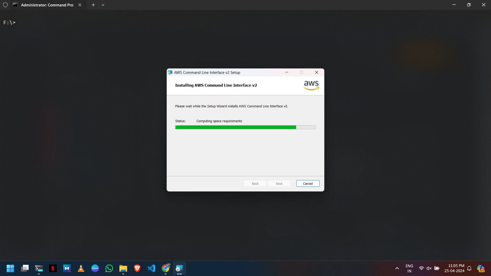
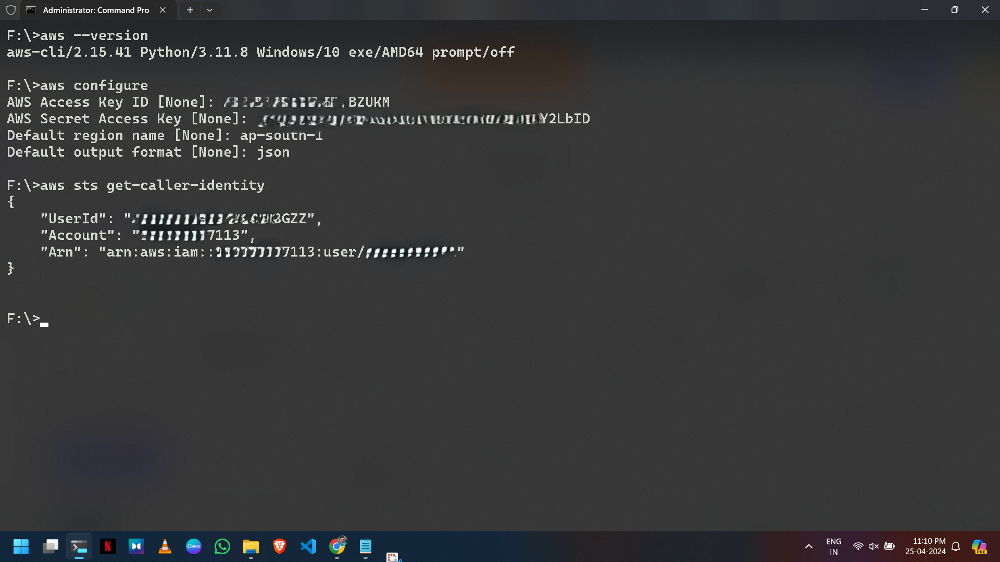
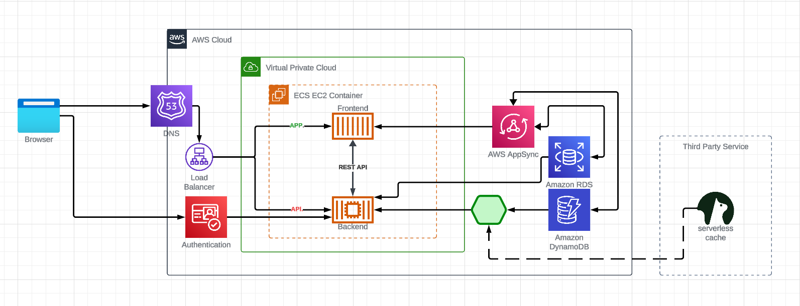

# Week 0 — Billing and Architecture

## Completed Homework/Tasks

### Installed and Verified AWS CLI

I encountered browser issues with Gitpod and Github Codespaces, so I opted for a local environment. Here's how I configured the AWS CLI on my Windows machine:

1. **Installed the AWS CLI** for Windows 10 via [AWS CLI MSI installer](https://docs.aws.amazon.com/cli/latest/userguide/getting-started-install.html).

   

   ```bash
   msiexec.exe /i https://awscli.amazonaws.com/AWSCLIV2.msi
   ```

2. Initially encountered an error when running the command `aws`:

   ```bash
   C:\Users\Andrew>aws
   'aws' is not recognized as an internal or external command,
   operable program or batch file.
   ```

3. **Resolved** the error by reopening the command prompt.

   

### Created a Budget

Set up a budget with a $1 limit due to financial constraints, refrained from creating a second budget to avoid exceeding the free limit.


### Recreated Logical Architectural Design



[Lucid Charts Share Link](https://lucid.app/lucidchart/b591aaa2-b84b-4bac-98d3-0bc255dd7acc/edit?viewport_loc=-264%2C-220%2C2240%2C1065%2C0_0&invitationId=inv_7b8cedfe-bfac-47d5-91c1-56b1a8d1caee)

## Used bfg tool to remove sensitive credentials

Check this out :
[View alarm_config.json](https://github.com/anand-mukul/aws-bootcamp-cruddur-2023/blob/54f8c96943c2b175c15ca97346bf44b934828c78/aws/json/alarm_config.json)

**Description**: This JSON file contains the configuration settings for the alarm system used in the AWS Bootcamp project.

--- OR ---

## alarm_config.json

```json
{
  "AlarmName": "DailyEstimatedCharges",
  "AlarmDescription": "This alarm would be triggered if the daily estimated charges exceed $1",
  "ActionsEnabled": true,
  "AlarmActions": [
    "arn:aws:sns:ca-central-1:***REMOVED***:billing-alarm"
  ],
  "EvaluationPeriods": 1,
  "DatapointsToAlarm": 1,
  "Threshold": 1,
  "ComparisonOperator": "GreaterThanOrEqualToThreshold",
  "TreatMissingData": "breaching",
  "Metrics": [
    {
      "Id": "m1",
      "MetricStat": {
        "Metric": {
          "Namespace": "AWS/Billing",
          "MetricName": "EstimatedCharges",
          "Dimensions": [
            {
              "Name": "Currency",
              "Value": "USD"
            }
          ]
        },
        "Period": 86400,
        "Stat": "Maximum"
      },
      "ReturnData": false
    },
    {
      "Id": "e1",
      "Expression": "IF(RATE(m1)>0,RATE(m1)*86400,0)",
      "Label": "DailyEstimatedCharges",
      "ReturnData": true
    }
  ]
}
```
